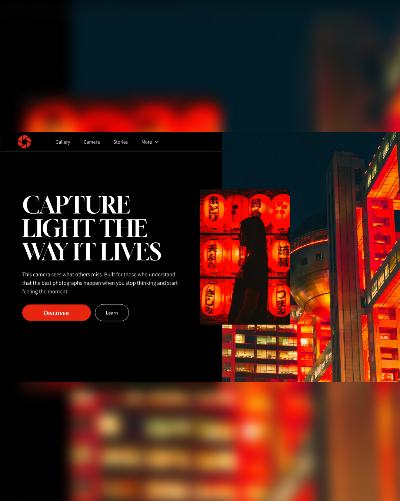
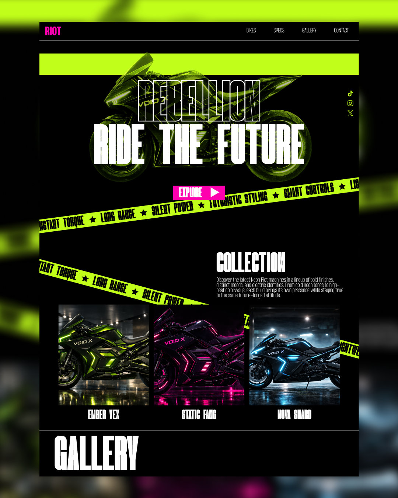
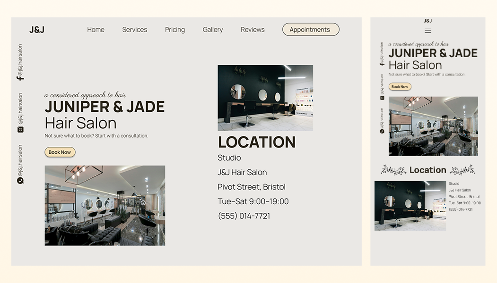

<h3 align="center">Fullstack Web Developer ✶ Frontend-Focused ✶ TypeScript / React / Next.js</h3>

  
<b>Languages & Tools</b>

   

  <table>
    <tr>
      <td valign="top" width="50%">
        <b>Core</b> 
        

          
          
          
          
          
          
        

        <b>Frontend</b> 
        

          
          
          
          
          
        

        <b>Backend / DB</b> 
        

          
          
          
          
          
        

      </td>
      <td valign="top" width="50%">
        <b>Dev Tools</b> 
        

          
          
          
          
        

        <b>Design / Creative</b> 
        

          
          
          
          
        

        <b>AI / Data</b> 
        

          
          
          
          
          
        

      </td>
    </tr>
  </table>

  
<b>UI Showcase</b>

   

  

    <table>
      <tr>
        <td align="center">
          
        </td>
        <td align="center">
          
        </td>
      </tr>
      <tr>
        <td align="center">
          
        </td>
        <td align="center">
          
        </td>
      </tr>
    </table>
  

